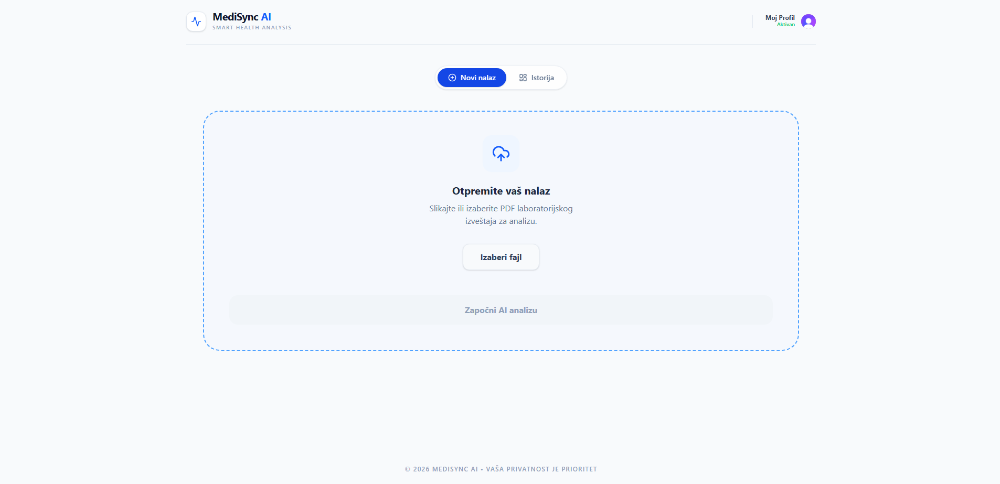
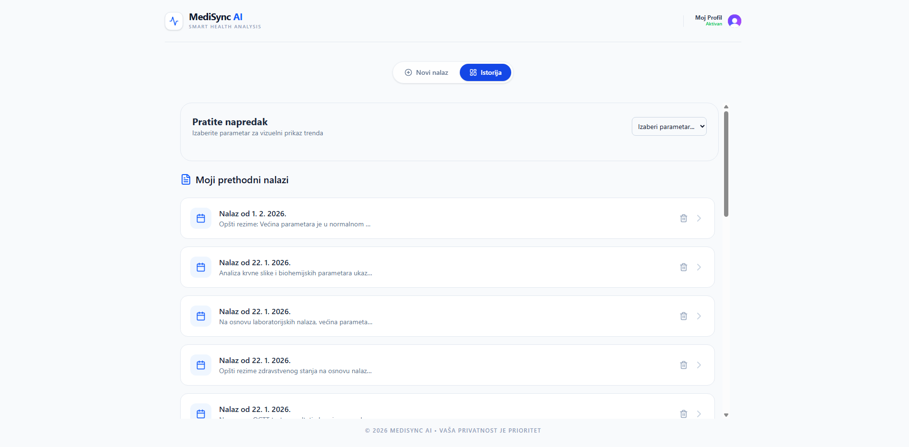

# MediSync AI – Smart Health Analysis Platform

**MediSync AI** is a modern SaaS platform that leverages the power of artificial intelligence to make laboratory results understandable for everyone. Instead of complex tables and medical jargon, users receive clear, visual, and precise insights into their health status.

---

### Home Screen

### Dashboard

### History

### Summary

---

## Key Features

- **AI Analysis (GPT-4o):** Instant interpretation of laboratory parameters with personalized health advice.
- **Drag & Drop Interface:** Modern environment for uploading PDF and image formats (OCR supported).
- **Trend Tracking:** Interactive charts displaying the progression of values across the history of findings.
- **Digital Report:** Capability to download detailed PDF reports for easier consultation with doctors.
- **Data Security:** Enterprise-grade authentication powered by **Clerk**.
- **SaaS UI/UX:** Minimalist design optimized for clarity and ease of use.

---

## Tech Stack

| Layer | Technology |
| :--- | :--- |
| **Frontend** | React 18, TypeScript, Vite |
| **Styling** | Tailwind CSS (SaaS Minimalism) |
| **Authentication** | Clerk Auth |
| **AI Intelligence** | OpenAI API (GPT-4o Model) |
| **Visualization** | Lucide React (Icons), Recharts (Charts) |
| **PDF Generation** | @react-pdf/renderer |